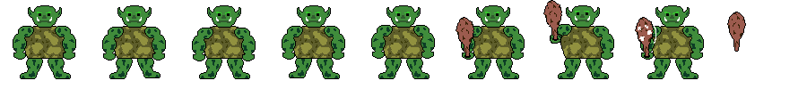
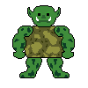

import FigmaBoard from "@/components/figma/figma-board";

# Blog 2: Second time's the charm 👀

**Hi everyone!** 👋  
This is the **second** blog post for the game Spellqwest. This week, among expanding the game, we tried to work with concepts from last weeks presentation.

## Accomplishments this week 🚀

In this week, our focus was on **refining** the already existing parts of the game from last weeks prototype, as well as expanding the game to now include a rudimentary **map-view** and an **inventory**.
We thought a lot about the best approach to make an easily expandable and modular base for the game and are happy with the results.
We had fun creating the first enemy concepts and designs. However over-motivation got the better of us, so some designs got a little too detailled. This will be reworked to better represent the _pixely_ artstyle we're going for.

Here is an example of one enemy we designed and created:

Tldr:

- Added a randomly generated Map-prototype
- Added an inventory system
- Enemy design
- Bug fixes

## Next week's goals 🎯

- **Expanding the map view**
    - Add different, randomly placed, Events
        - Shops
        - Treasure Spots
        - NPC Encounters
- **Expand the Combat Loop**
    - Formulate a plan to spawn specific enemies for each stage
        - Enemy-Stage pools
    - Make Combat winnable
        - Add Enemy Counter
        - Add Rewards for defeating enemies and winning a combat encounter
- **More assets**
    - Sprites
    - Sounds
    - ...
- **Other / Miscellaneous**
    - Refine and rework Hit-Reg functionality

## Distribution of work 📊

### Tasks

- **Everyone:** Getting familiar with the technology (Godot, Strudel, Nextra...)
- **Moritz, Julian & Elias:** Enemy Design (concecpt and visuals)
- **Julian:** Implement enemy types
- **David:** Create a basic Map-View-prototype
    - Random generation
    - Access to events via Nodes (just combat for now)
- **David:** Implement Inventory & Item system
    - Inventory Popup and action menu
    - Item prototype (resource & functionality)

### Team Members

| Name   | Time Spent |
| ------ | ---------- |
| David  | `18h`      |
| Elias  | `7h`       |
| Julian | `13h`      |
| Moritz | `5h`       |

---

### Figma Brainstorming Board

<FigmaBoard />
